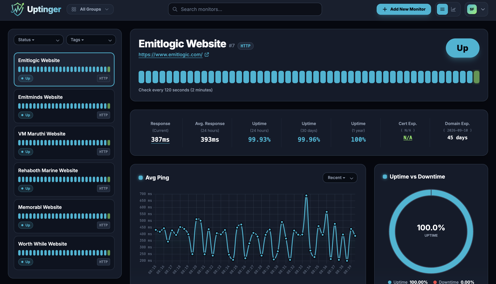
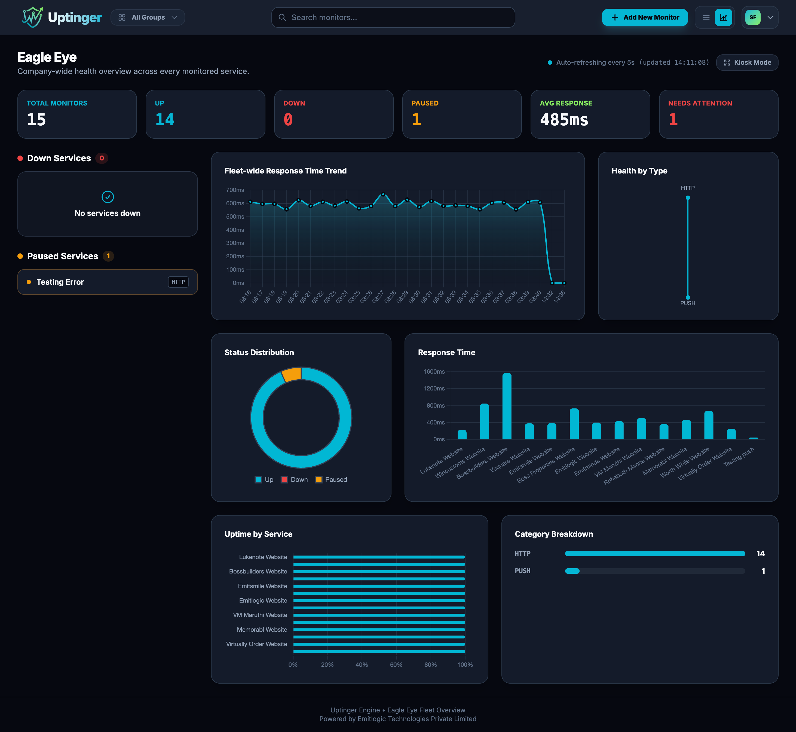
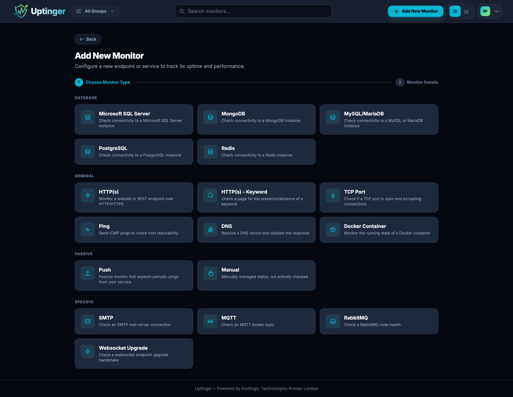

<div align="center">


# Uptinger

**A lightweight, self-hosted uptime & health monitoring platform.**

Track HTTP endpoints, databases, ports, DNS records, message brokers, containers and more —
on a single low-spec box, with room to spare.

[](#-getting-started)
[](LICENSE)
[](https://nodejs.org)
[](https://www.typescriptlang.org/)
[](Dockerfile)
[](#-why-uptinger)

</div>

---

## Why Uptinger?

Most uptime monitors either want your credit card every month, or want a
Postgres cluster, a Redis instance, and half a gigabyte of Node processes just
to tell you a website is down.

**Uptinger doesn't.** It's a single Node.js process backed by embedded SQLite
— no external database, no message broker to babysit, no multi-container
orchestration required. It's built to comfortably run monitoring for a real
fleet of services on a machine as small as:

> **1 vCPU · 500 MB RAM (often less)**

That makes it a great fit for a $4/month VPS, a Raspberry Pi, a spare corner
of your homelab, or a tiny container in your existing Kubernetes cluster —
anywhere you don't want to dedicate serious infrastructure just to know
whether your stuff is up.

---

## ✨ Features

- **16 monitor types** across HTTP, network, databases, and message brokers (see below)
- **Retry-aware status engine** — configurable retry count + retry interval before a monitor is actually marked down, so flaky blips don't spam your team
- **Email alerting** — down / recovered / paused notifications, fully custom email templates per organization, with live preview and test-send
- **Heartbeat Event Logs** — per-monitor check history with status and date filters
- **Response time & uptime analytics** — live charts (Avg Ping, Uptime vs Downtime, 24h/30d/1y uptime) with selectable time ranges
- **Eagle Eye** — a fleet-wide kiosk/TV dashboard view for NOC-style rooms and status walls, with auto-scrolling kiosk mode
- **Groups & Tags** — organize monitors by team, environment, or service, and scope member access to specific groups
- **Role-based access control** — granular permissions (view/create/edit/delete monitors, manage org/roles/groups/tags/SMTP) with an Admin and Member role out of the box, fully customizable
- **Multi-user organizations** — invite teammates, assign roles, scope visibility to groups
- **Monitor backup & restore** — export every monitor in your org to a single JSON file and re-import it (disaster recovery, migrating instances, or cloning a setup)
- **SSL certificate & domain expiry tracking** — get ahead of expiring certs and domains on HTTP(S) monitors
- **Push & Manual monitors** — for passive checks driven by your own cron jobs/scripts, or manually toggled status
- **Custom SMTP** — bring your own mail server for outbound alerts
- **Dark, modern UI** — built with Tailwind CSS, no clutter

---

## 🩺 Monitor Types

| Category      | Types                                                                 |
|----------------|------------------------------------------------------------------------|
| **General**    | HTTP(s), HTTP(s) + Keyword match, TCP Port, Ping (ICMP), DNS, Docker Container |
| **Passive**    | Push (heartbeat URL from your own script/cron), Manual (manually toggled) |
| **Specific**   | SMTP, MQTT, RabbitMQ, WebSocket Upgrade                                |
| **Database**   | Microsoft SQL Server, MongoDB, MySQL / MariaDB, PostgreSQL, Redis      |

---

## 🎯 Use Cases

- **Solo devs / side projects** — keep an eye on your app, API, and database without paying for a SaaS monitor per endpoint
- **Small teams & startups** — shared dashboard, role-based access, email alerts to the right people
- **Homelabs & self-hosters** — monitor your NAS, Docker containers, reverse proxy, and internal services alongside your public site
- **Internal/private infrastructure** — monitor services that never touch the public internet (a hosted SaaS monitor physically can't reach them; Uptinger runs wherever you do)
- **NOC / status wall displays** — point a spare monitor or TV at the Eagle Eye kiosk view for an at-a-glance fleet health board
- **Agencies managing client sites** — group monitors per client, scope team members to only the groups they manage
- **Compliance-sensitive environments** — self-hosted means your uptime data, check history, and credentials never leave infrastructure you control

---

## 📸 Screenshots

### Monitor Detail — response time, uptime & heartbeat history at a glance



### Eagle Eye — fleet-wide kiosk dashboard for status walls



### Add Monitor — 16 monitor types, one clean flow



> _More screenshots (Login, Organization Settings) coming soon — drop your own into `docs/screenshots/` (see [docs/screenshots/README.md](docs/screenshots/README.md) for filenames) and they'll show up here automatically._

---

## 🧱 Tech Stack

| Layer            | Technology                                                        |
|-------------------|--------------------------------------------------------------------|
| Runtime           | [Node.js 22](https://nodejs.org/) (TypeScript, compiled to CommonJS) |
| Language          | [TypeScript 5/7](https://www.typescriptlang.org/)                 |
| Web framework     | [Express 5](https://expressjs.com/)                               |
| Views             | [EJS](https://ejs.co/) (server-rendered templates)                |
| Styling           | [Tailwind CSS 4](https://tailwindcss.com/)                        |
| Database          | [SQLite](https://www.sqlite.org/) via `better-sqlite3` (embedded, zero external services) |
| Auth              | JWT (`jsonwebtoken`) + `bcrypt` password hashing                  |
| Charts            | [Chart.js](https://www.chartjs.org/) (Avg Ping, Uptime/Downtime, Response Time, Eagle Eye graphs) |
| Mail              | `nodemailer` — bring your own SMTP                                |
| Monitoring probes | `ping`, `mysql2`, `pg`, `mongodb`, `tedious` (MSSQL), `ioredis`, `mqtt`, `amqplib` (RabbitMQ), `ws`, `whois` |
| Container image   | `node:22-bookworm-slim`, multi-stage Docker build                 |

---

## 🚀 Getting Started

### Option 1 — Docker Compose (recommended)

```bash
git clone https://github.com/fenilto-emitlogic/uptinger.git
cd uptinger
cp .env.example .env
```

Fill in `ENCRYPTION_KEY` and `JWT_ACCESS_SECRET` in `.env` (generate each with `openssl rand -hex 32`), then:

```bash
docker compose up -d --build
```

Uptinger will be available at `http://localhost:4173` (or your configured `PORT`).

### Option 2 — Run locally with Node

```bash
git clone https://github.com/fenilto-emitlogic/uptinger.git
cd uptinger
npm install
cp .env.example .env   # fill in ENCRYPTION_KEY and JWT_ACCESS_SECRET
npm run dev
```

The app listens on `http://localhost:4000` by default (or your configured `PORT`).

On first visit, Uptinger walks you through a one-time setup to create your organization and admin account — no manual database setup required, the SQLite schema is created automatically.

---

## 📦 Resource Footprint

Uptinger is deliberately built to stay small:

- **No external database** — SQLite lives on disk in the `data/` volume
- **No Redis/queue required** for core monitoring
- **Single process** — the web server and the monitoring engine run together
- Comfortably fits **under 1 vCPU and 500MB RAM** for typical fleets, scaling gracefully as you add more monitors

If you're choosing between renting a bigger box or just running Uptinger, you probably don't need the bigger box.

---

## 📜 License

Uptinger is free to **self-host and use for yourself, your team, or your organization** — forever, at no cost.

**Commercializing it (selling it, selling access to it, or reselling it as a service) is not permitted.** If you self-host it, please credit **Uptinger** and **Emitlogic Technologies Private Limited** somewhere your users/visitors can reasonably notice it (footer, About page, README, etc.).

See [LICENSE](LICENSE) for the full terms (PolyForm Noncommercial License 1.0.0 + attribution requirement).

---

<div align="center">

Made with care by **[Emitlogic Technologies Private Limited](https://www.emitlogic.com/)**.

If Uptinger is keeping an eye on your stack, consider dropping a ⭐ on the repo — it genuinely helps.

**Happy monitoring, and may your uptime always stay green.** 💙

</div>
